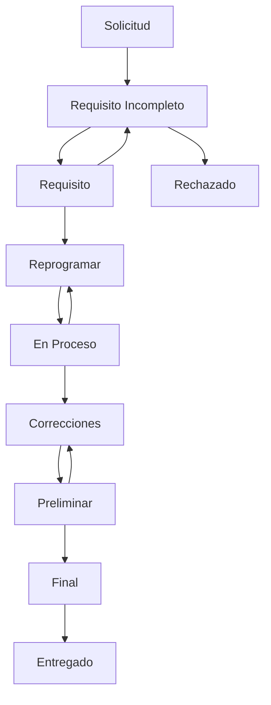

# Arquitectura del Sistema de Formularios y Estados

**Documento complementario a las Especificaciones Técnicas**  
**Fecha:** 11 de noviembre de 2025

---

## 🔄 1. Flujo Completo del Sistema

### 1.1 Proceso Empresarial

```
Empresa Cliente → Formulario Básico → Generación de Código → 
Consulta Antecedentes → Programación → Realización → 
Informe Preliminar → Informe Final → Autorización Repro → 
Entrega Cliente
```

### 1.2 Proceso del Evaluado

```
Empresa crea orden → Sistema genera evaluado en evaluados_orden → 
Token único enviado por email → Evaluado accede por link → 
Completa cuestionario → Sistema registra completación → 
Repro procesa resultados
```

---

## 📋 2. Diseño de Formularios Detallado

### 2.1 Formulario Básico (Punto de Entrada)

**Propósito:** Inicio de cualquier proceso de evaluación

**Campos Obligatorios:**
- Nombre completo
- Teléfonos (principal y secundario)
- DPI (validación 13 dígitos Guatemala)
- Correo electrónico
- Puesto a evaluar

**Campos Opcionales:**
- Empresa/Departamento
- Fecha tentativa
- Observaciones iniciales

**Funcionalidades:**
- Generador automático de código único
- Validador de DPI en tiempo real
- Consulta automática de antecedentes
- Carga de documentos adjuntos

### 2.2 Formularios por Tipo de Servicio

#### A. Formulario Preempleo
**Uso:** Polígrafo Preempleo, IVSAC Preempleo
**Características:** Formulario estándar para candidatos nuevos

**Secciones:**
1. **Datos Personales Extendidos**
2. **Historia Laboral**
3. **Referencias Personales**
4. **Antecedentes Legales**
5. **Información Financiera Básica**

#### B. Formulario Periódica/Específica
**Uso:** Polígrafo Periódico/Interno, Polígrafo Específico, IVSAC Periódico
**Características:** Para empleados actuales o situaciones específicas

**Secciones:**
1. **Datos de Empleado Actual**
2. **Período a Evaluar**
3. **Situación Específica** (si aplica)
4. **Referencias Internas**
5. **Declaraciones Específicas**

#### C. Formulario Estudio Socioeconómico
**Uso:** Evaluación socioeconómica completa
**Características:** Extiende el formulario Preempleo

**Secciones adicionales:**
1. **Composición Familiar**
2. **Ingresos y Gastos**
3. **Propiedades y Bienes**
4. **Hábitos y Estilo de Vida**
5. **Redes Sociales**

---

## 🔄 3. Estados y Transiciones Detalladas

### 3.1 Estados Principales

| Estado | Descripción | Responsable | Acciones Permitidas |
|--------|-------------|-------------|-------------------|
| **Solicitud** | Orden creada, pendiente revisión | Sistema | Ver, Editar, Cancelar |
| **Autorización** | Esperando aprobación interna | Repro | Aprobar, Rechazar, Solicitar cambios |
| **Requisito** | Requiere documentación firmada | Cliente | Subir documento, Contactar Repro |
| **Programación** | Asignando fecha y modalidad | Repro | Programar, Cambiar modalidad |
| **En Proceso** | Evaluación en curso | Repro | Completar, Suspender, Reprogramar |
| **Análisis** | Procesando resultados | Repro | Generar preliminar, Analizar |
| **Preliminar** | Informe preliminar listo | Repro | Generar final, Corregir |
| **Final** | Informe final generado | Repro | Autorizar entrega, Revisar |
| **Entregado** | Informe entregado al cliente | Sistema | Ver historial, Archivar |

### 3.2 Transiciones Automáticas



---

## 🎯 4. Modalidades de Evaluación

### 4.1 Presencial
- Evaluado asiste físicamente
- Equipos especializados
- Supervisión directa
- Tiempo controlado

### 4.2 Virtual
- Acceso remoto supervisado
- Plataforma online segura
- Verificación de identidad
- Grabación de sesión (opcional)

---

## 📊 5. Sistema de Reportes

### 5.1 Preliminar General
**Propósito:** Avance inicial para decisiones rápidas
**Contenido:**
- Resumen ejecutivo
- Resultados principales
- Recomendaciones iniciales
- Áreas que requieren profundización

**Tiempo de entrega:** 24-48 horas post-evaluación

### 5.2 Reporte Final
**Propósito:** Análisis completo y detallado
**Contenido:**
- Metodología empleada
- Resultados detallados
- Análisis psicológico/técnico
- Recomendaciones específicas
- Conclusiones finales
- Anexos técnicos

**Tiempo de entrega:** 5-7 días laborales

---

## 🔐 6. Control de Acceso a Informes

### 6.1 Flujo de Autorización

1. **Generación:** Repro genera el informe
2. **Revisión Interna:** Supervisor de Repro revisa
3. **Aprobación:** Repro autoriza la entrega
4. **Notificación:** Cliente recibe aviso de disponibilidad
5. **Acceso:** Cliente puede descargar/ver informe

### 6.2 Niveles de Acceso

| Rol | Preliminar | Final | Histórico | Datos Raw |
|-----|------------|--------|-----------|-----------|
| **Cliente** | ❌ | ✅* | ❌ | ❌ |
| **Repro** | ✅ | ✅ | ✅ | ✅ |
| **Admin** | ✅ | ✅ | ✅ | ✅ |

*Solo si está autorizado por Repro

---

## 🛠️ 7. Implementación Técnica

### 7.1 Formularios Dinámicos

```php
// Estructura base de formularios
abstract class BaseFormulario {
    protected $campos_base = [
        'nombre', 'dpi', 'email', 'telefono', 'puesto'
    ];
    
    abstract function getCamposEspecificos();
    abstract function getValidacionesEspecificas();
    abstract function procesarRespuestas($datos);
}
```

### 7.2 Estado de Órdenes

```php
// Enum de estados
enum EstadoOrden: string {
    case SOLICITUD = 'solicitud';
    case AUTORIZACION = 'autorizacion';
    case REQUISITO = 'requisito';
    case PROGRAMACION = 'programacion';
    case EN_PROCESO = 'en_proceso';
    case ANALISIS = 'analisis';
    case PRELIMINAR = 'preliminar';
    case FINAL = 'final';
    case ENTREGADO = 'entregado';
}
```

### 7.3 Sistema de Tokens para Evaluados

```php
// Generación de acceso temporal
class TokenEvaluado {
    public static function generar($evaluado_id) {
        return [
            'token' => Str::random(64),
            'expira_en' => now()->addDays(30),
            'url' => route('cuestionario.acceso', ['token' => $token])
        ];
    }
}
```

---

## 📈 8. Métricas y Seguimiento

### 8.1 KPIs del Sistema

- **Tiempo promedio por estado**
- **Tasa de completación de cuestionarios**
- **Tiempo de entrega de informes**
- **Satisfacción del cliente**
- **Eficiencia del proceso**

### 8.2 Dashboard Ejecutivo

- Vista general de órdenes activas
- Estados de todas las evaluaciones
- Cuellos de botella identificados
- Próximas fechas límite
- Alertas y notificaciones

---

**Estado:** 📋 Documento de referencia para desarrollo  
**Próxima actualización:** Al completar módulo de órdenes