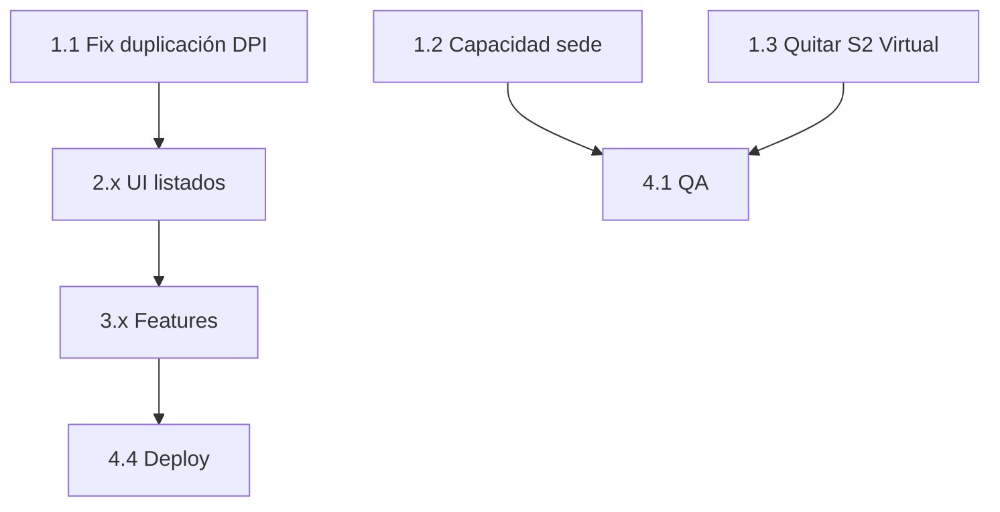

# Fase 19 — Alcance definitivo (respuestas cliente 11/06/2026)

**Fuente:** PDF `REPRO propuesta de cambios y preguntas 11 Junio 2026 respuestas.pdf`  
**Base:** Propuesta `Informe_Cliente_2026-06-12_Propuesta_Ajustes.md`  
**Estado:** Aprobado por cliente — listo para desarrollo  
**Plataforma:** https://reproappv2.szystems.com

---

## Resumen ejecutivo

El cliente **confirmó los 9 temas + ajustes menores**, pero con **correcciones importantes** respecto a lo que había comentado por chat:

| Tema | Lo que habíamos asumido | Lo que confirmó el PDF |
|------|-------------------------|-------------------------|
| Bloqueo formulario → **En Proceso** | Quitarlo | **MANTENER** — requisito para iniciar prueba |
| Bloqueo formulario → **Programar Virtual** | Quitarlo | **QUITAR** — confirmado |
| Bloqueo cita → **En Proceso** | Evaluar | **MANTENER** |
| Selector de estados | Más libertad | **Solo el siguiente paso** (sin saltos) |
| Calendario desde orden | Bug activo | **Retest OK** — sin cambios funcionales prioritarios |
| Anti-traslape poligrafista | Mantener 1 cita/evaluador | **ELIMINAR** — mismo evaluador puede tener varias |
| Capacidad sede | Usar campo capacidad | **Sí** — lo editan ellos en Sedes |
| Eliminar órdenes | Borrado permanente | **Archivar** (no borrar expediente) |
| Historial cliente | Toggle | **Visible con observaciones**; interruptor **por defecto visible (ON)** |

**Solicitud nueva (final del PDF):** búsqueda en **Historial por DPI** también por **nombre y apellidos**.

**Caso de prueba duplicación:** orden `ORD-2026-0010` — candidato *PRUEBA NUMERO PRUEBA DUPLICACIÓN*.

---

## Matriz de decisión — Sección por sección

### 1. Reglas de estados (sinergia)

| ID | Pregunta | Respuesta cliente | Acción desarrollo |
|----|----------|-------------------|-----------------|
| 1A | ¿Quitar bloqueo formulario → En Proceso? | **NO** — debe exigir formulario completado | **Mantener S4** en `cambiarEstadoEvaluacion()` |
| 1B | ¿Quitar bloqueo formulario → Programar Virtual? | **SÍ** | **Eliminar S2** en `CalendarioController::programar()` |
| 1C | ¿Quitar bloqueo cita programada → En Proceso? | **NO** | **Mantener S5** |
| 1D | ¿Selector de estados? | **Solo el siguiente paso** | **Sin cambios** en `transiciones*()` |

> **Nota:** Esto alinea el sistema con el acuerdo formal de Fase 18 en Evaluación, y solo relaja la regla de **programación Virtual**.

---

### 2. Programar desde orden ↔ Calendario

| Respuesta | Detalle |
|-----------|---------|
| **Sin cambios prioritarios** | Rehicieron pruebas y ya funciona desde la orden |
| **Preventivo** | Aún aplicar correcciones del **punto 9** (no resetear estados al editar) para evitar regresiones |

**Opcional (baja prioridad):** enlace “Ver en calendario” tras programar desde orden.

---

### 3. Capacidad de sede y citas simultáneas

| Respuesta | Detalle |
|-----------|---------|
| 3A | Límite por **sede** usando campo **Capacidad** editable en módulo Sedes |
| 3B | **Sí** — un mismo evaluador puede tener **varias citas a la misma hora** |
| 3C | Capacidad la configuran ellos por sede (no hardcodear números) |

**Acción desarrollo:**

1. Reemplazar lógica de `Sede::tieneTraslape()`:
   - Contar citas solapadas en la **sede** (excl. cancelado/desistio/inasistencia en programación).
   - Permitir si `count < sede.capacidad`.
2. **Eliminar** bloqueo por mismo `poligrafista_id` en el mismo horario.
3. Actualizar mensaje de error: indicar capacidad de sede agotada.
4. Tests: sede cap=3 → 3 citas misma hora OK; 4ª rechazada.

---

### 4. Inasistencia (Programación)

| Respuesta | Detalle |
|-----------|---------|
| 4A | **Sí** — solo desde **Programado**; ya encontraron la opción |
| 4B | **No** — sin botón extra “Marcar inasistencia” |

**Acción desarrollo:** solo **bugfix visual** en calendario (`estado_evaluacion` → `estado_programacion` para inasistencia).

---

### 5. Historial visible al cliente

| Respuesta | Detalle |
|-----------|---------|
| 5A | **Sí** — el cliente (empresa) debe ver el historial |
| 5B | **Sí** — **con observaciones/motivos** |
| 5C | **Visible** — rechaza OFF por defecto → interruptor en Config con **default ON** |

**Acción desarrollo:**

1. Migración: `configs.historial_visible_empresa` (boolean, default `true`).
2. Switch en `admin/config` (solo admin REPRO).
3. Panel historial en `empresa/ordenes/show.blade.php` por evaluado (misma tabla que admin, filtrada si hace falta).
4. Si toggle OFF → comportamiento actual (solo REPRO).

---

### 6. Etiquetas “Estado de…”

| Respuesta | **Sí**, de acuerdo con nombres propuestos |

**Pantallas:** `admin/ordenes/index`, `admin/reportes/evaluaciones`, `admin/cuestionarios/index`, `admin/index`, PDFs/exportaciones de evaluados, filtros ambiguos.

**No tocar:** estado activo/inactivo de empresa, usuario, sede.

---

### 7. Gestión de Cuestionarios

| Respuesta | **Sí** — 3 columnas de estado + progreso del cuestionario |

**Columnas:** Estado de Formulario | Estado de Programación | Estado de Evaluación | Progreso cuestionario

---

### 8. Eliminar órdenes bloqueadas

| Respuesta | Detalle |
|-----------|---------|
| 8A | **Solo administrador** REPRO (`role_as >= 3`) |
| 8B | **Archivar** — no eliminación permanente |

**Acción desarrollo:**

1. Campo `ordenes.archivada` o `deleted_at` + scope `activas()`.
2. Botón “Archivar orden” solo admin, con confirmación (código de orden).
3. Órdenes archivadas: ocultas de listados normales; consulta opcional “Ver archivadas” (admin).
4. **No** borrar evaluados, cuestionarios ni historial.
5. Log/auditoría de quién archivó.

> Pendiente técnico menor: ¿empresa ve sus órdenes archivadas? Asumir **no** hasta que lo pidan.

---

### 9. Duplicación al editar orden

| Respuesta | Caso: `ORD-2026-0010`, candidato *PRUEBA NUMERO PRUEBA DUPLICACIÓN* — al editar nombre, DPI, dirección, modalidad P→V, etc. |

**Acción desarrollo (P0):**

1. `procesarEvaluados()` en update: preservar `estado_formulario`, `estado_programacion`, `cuestionario_completado`, tokens.
2. Actualización por `id` aunque cambie DPI; no crear registro nuevo.
3. Fix JS `edit.blade.php`: reindexar `<select>` y `<textarea>`, no solo `<input>`.
4. Tests: cambio DPI con id, cambio modalidad, sin duplicar — caso ORD-2026-0010.

---

### 10. Ajustes menores (confirmados)

| # | Tema | Incluir |
|---|------|---------|
| 10.1 | Menú: Informes bajo Órdenes de Evaluación | Sí |
| 10.2 | Listado evaluados (reportes): 3 estados + teléfono (ESTADOS.pdf) | Sí |
| 10.3 | Poligrafista y Responsable **opcionales** al programar | Sí |
| 10.4 | Texto ayuda: modalidad se guarda al Guardar orden o Programar | Sí |

---

### 11. NUEVO — Historial por DPI: búsqueda por nombre

**Solicitud textual del PDF:**

> *"EN LA BUSQUEDA POR DPI TAMBIÉN QUISIERA QUE SE PUEDA POR NOMBRES Y APELLIDOS."*

**Estado actual:** `historial-dpi` solo acepta DPI 13 dígitos (`historialPorDpi()`).

**Acción desarrollo:**

1. Campo de búsqueda: DPI **o** nombre/apellidos.
2. `CuestionariosController::historialDpi()` + scope en `EvaluadoOrden`.
3. Renombrar UI: “Historial por DPI o nombre” (sidebar + título).
4. Resultados agrupados si hay homónimos.

---

## Lo que NO entra en Fase 19

| Ítem | Motivo |
|------|--------|
| Quitar S4 (formulario → En Proceso) | Cliente rechazó en PDF |
| Quitar S5 (cita → En Proceso) | Cliente rechazó |
| Saltos libres en selectores de estado | Cliente: solo siguiente paso |
| Botón “Marcar inasistencia” | Cliente: no |
| Borrado permanente de órdenes | Cliente: archivar |
| Refactor grande calendario↔orden | Cliente: ya funciona |

---

## Orden de desarrollo integral

### Sprint 1 — P0 Correcciones críticas (bloquean operación)

| Orden | ID | Tarea | Archivos principales |
|-------|-----|-------|----------------------|
| 1.1 | 9 | Fix duplicación + preservar estados al editar orden | `OrdenesController`, `edit.blade.php`, tests |
| 1.2 | 3 | Capacidad por sede; quitar límite por poligrafista | `Sede.php`, `CalendarioController`, tests `CalendarioTest` |
| 1.3 | 1B | Quitar S2 (Virtual + formulario al programar) | `CalendarioController`, tests sinergia |

**Criterio de salida:** ORD-2026-0010 editable sin duplicar; 3 citas misma hora si sede cap=3; Virtual programable sin formulario.

---

### Sprint 2 — UI y alineación Fase 18

| Orden | ID | Tarea |
|-------|-----|-------|
| 2.1 | 6 | Renombrar columnas/filtros “Estado de…” |
| 2.2 | 7 | Cuestionarios index: 3 estados + progreso |
| 2.3 | 10.2 | Reportes evaluaciones: columnas ESTADOS.pdf |
| 2.4 | 4 | Fix badge inasistencia en calendario |
| 2.5 | 10.1 | Sidebar: Informes bajo Órdenes |
| 2.6 | 10.3 | Poligrafista/responsable opcionales (`ProgramarCitaRequest` + vistas) |
| 2.7 | 10.4 | Ayuda modalidad en orden show/edit |

---

### Sprint 3 — Funcionalidades nuevas

| Orden | ID | Tarea |
|-------|-----|-------|
| 3.1 | 5 | Historial visible empresa + config toggle (default ON) |
| 3.2 | 11 | Historial búsqueda por nombre/apellidos |
| 3.3 | 8 | Archivar órdenes (solo admin) |

---

### Sprint 4 — QA, documentación, deploy

| Orden | Tarea |
|-------|-------|
| 4.1 | Regresión Fase 18: S4 y S5 siguen activos |
| 4.2 | Tests nuevos + actualizar tests S2/S3 |
| 4.3 | Informe cliente Fase 19 (estilo Mayo/Junio) |
| 4.4 | Deploy iPage + migraciones |

---

## Diagrama de dependencias

---

## Checklist de verificación con cliente (post-desarrollo)

- [ ] Editar ORD-2026-0010 (o similar) sin duplicar candidato
- [ ] Sede cap=3 permite 3 citas a las 9:00; 4ª muestra error claro
- [ ] Mismo evaluador con 2+ citas misma hora: permitido
- [ ] Virtual: programar sin formulario completado
- [ ] En Proceso: **sigue bloqueando** sin formulario (confirmar que así lo quieren)
- [ ] Empresa ve historial con observaciones
- [ ] Admin puede archivar orden en proceso
- [ ] Buscar historial por nombre "PRUEBA"
- [ ] Listados muestran "Estado de Orden", "Estado de Formulario", etc.

---

## Referencias

- Propuesta enviada: `docs/Informe_Cliente_2026-06-12_Propuesta_Ajustes.md` *(si no está en repo, recuperar de commit `a096ed0b`)*
- Respuestas cliente: PDF 11/06/2026 en Downloads
- Seguimiento técnico: `PROGRESS.md` → sección Fase 19

---

*Documento interno + base para informe post-deploy — 12/06/2026*
